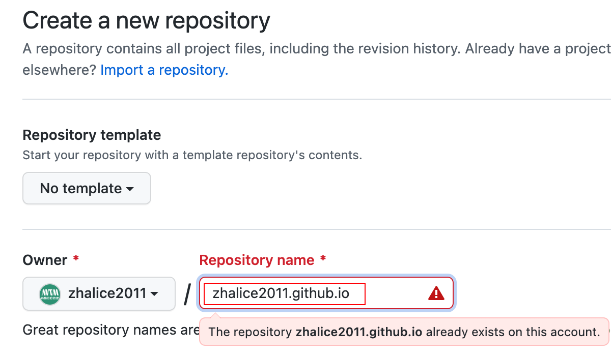

### 一.新建Github Page

先新建一个`repository`, 命名为 `username.github.io` (注意修改username为你自己的)



### 二.创建博客

安装`gatsby`脚手架

```shell
npm install -g gatsby-cli
```

使用该模板建立你的`gatsby`博客
```shell
gatsby new my-blog https://github.com/zhalice2011/blog
```

进入开发
```shell
cd my-blog
gatsby develop
```

打开  http://localhost:8000 查看页面, 然后本地进行博客的修改, 文章均放置在 `content`文件夹


### 三.发布博客

链接到远程仓库(注意修改username为你自己的)
```shell
git remote add origin git@github.com:username/username.github.io.git
```

发布
```
npm run deploy
```

此时可以看到你的 `username.github.io` 仓库多了一个 `gh-pages
` 分支


设置 `Github Pages` 展示的分支为 `gh-page` (如果设置成`master`会很凌乱, 因为都是打包后的文件)


接下来就可以访问你的博客啦~ (注意修改username为你自己的)  [https://username.github.io](https://zhalice2011.github.io/blog)
